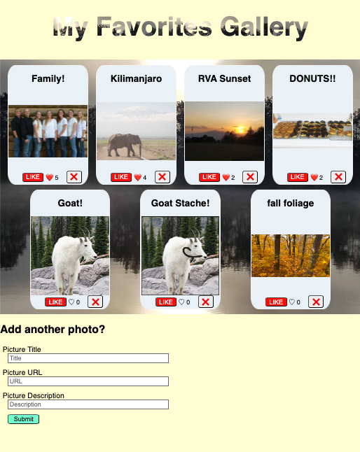

# React Favorites Photo Gallery

## Description

Duration: Weekend Sprint

This app provides an opportunity to post photos of favorite things, including a text description and a url must be provided. Currently actual photos must be put into the /public/images folder, but website photos just need a url. The form is at the bottom of the page.

Photos are initially displayed but if a photo is clicked the display toggles to the written description of the photo - and toggles back if the description is clicked.

Once displayed, there is a Like button. If it is clicked, it allows the user to unlike. A tally of Likes is displayed. Additionally, there is a Delete button to remove the posted photo.

L

Additional README details can be found [here](https://github.com/PrimeAcademy/readme-template/blob/master/README.md).

## Screenshot

## Prerequisites
Node.js

## Installation
1. Execute the SQL Queries located in database.sql. Ensure that your database is named 'fs-react-shopping'

2. Run `npm install` in your terminal to install dependencies.

3. Run `npm install sweetalerts2` in your terminal to install sweetalerts2 for warning windows

4. Run the server using `npm run server` in terminal.

5. Run the client using `npm run client` in terminal.

## Built With
Node.js
React
Vite
PostGreSQL
Axios
Express

## Acknowledgement
Prime Academy instructors and colleagues